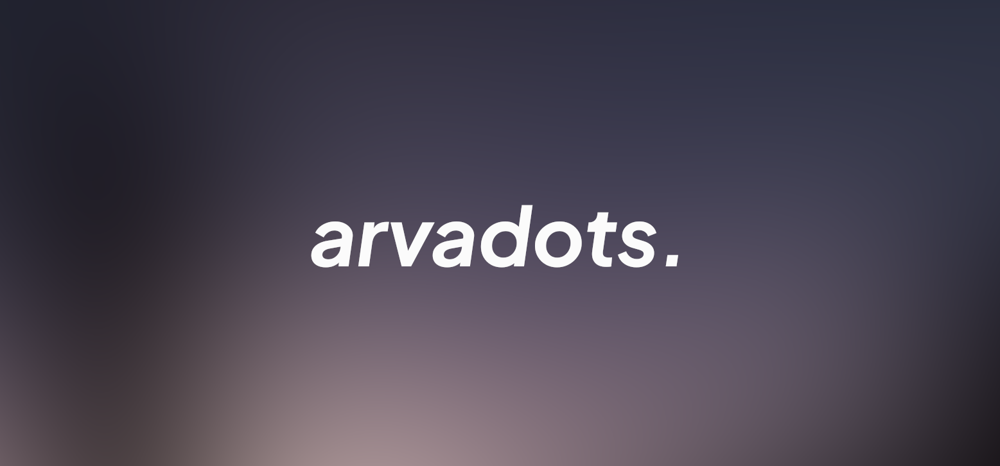

                                                                                     
          Arvareza's dots</h1>                                                                                    
  </a>

 

Catppuccin-themed i3wm and Arch Linux rice

Loosely inspired by typecraft's dotfiles

## Softwares
- [Arch Linux](https://archlinux.org)
- [i3wm](https://i3wm.org/)
- [Polybar](https://github.com/polybar/polybar)
- [Kitty](https://sw.kovidgoyal.net/kitty)
- [Neofetch](https://github.com/dylanaraps/neofetch)
- [Btop](https://github.com/aristocratos/btop)
- [Catppuccin](https://github.com/catppuccin/catppuccin)
- [Rofi](https://github.com/davatorium/rofi)
- [Betterlockscreen](https://github.com/betterlockscreen/betterlockscreen)
- [Neovim](https://neovim.io/)
- [AstroNvim](https://astronvim.com/)

## Credits
- [typecraft's dotfiles](https://github.com/typecraft-dev/dotfiles)

